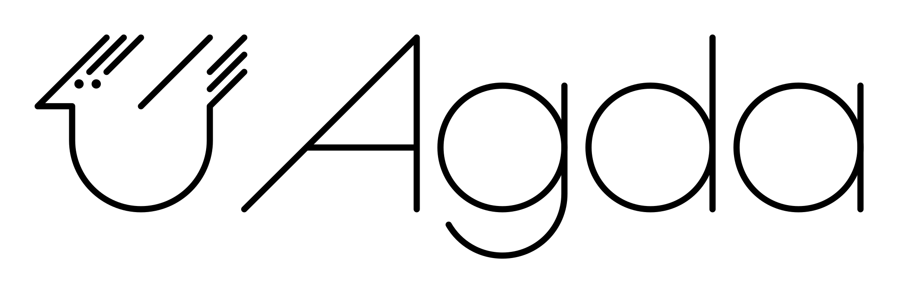

<link rel="stylesheet" href="gh-fork-ribbon.css" />
<style>.github-fork-ribbon:before { background-color: #333; }</style>
<a class="github-fork-ribbon" href="https://github.com/teach-types/www" data-ribbon="Sources on GitHub" title="Sources on GitHub">Sources on GitHub</a>

{#id .class width=480}

Most course information is on [Canvas](https://chalmers.instructure.com/courses/41019).

Further course links:
[Schedule on TimeEdit](https://cloud.timeedit.net/chalmers/web/public/ri15730Qgv0ZQYQ1005669y35Y1gQZ9Y506x1XZQ6.html) /
[Chalmers studieportal](https://www.student.chalmers.se/sp/course?course_id=44940) /
[GU ad (sv)](https://www.gu.se/studera/hitta-utbildning/typer-for-program-och-bevis-dit235) /
[GU kursplan](http://kursplaner.gu.se/pdf/kurs/sv/DIT235) /
[GU course description](http://kursplaner.gu.se/pdf/kurs/en/DIT235) /
[Course page 2025](2025/index.html)


Schedule
========

This schedule is preliminary!

| Date | Time | Teacher | Title | Reading / Remark |
|-------|----|-|----------------------------|------------------|
| Thu 03/09   | 10-12   | AA | 01 [Introduction to Agda](#lecture-1) | LN 1 - 3; VFP 1, 3; DTW 1, 2.1 - 2.5 |  |
| Mon 07/09   | 13-15   | TC | 02 [Dependent types](#lecture-2) |  |
| _Mon 07/09_ | _15-17_ | AA | [Getting started with Agda](#exercise-1) |  |
| Thu 10/09   | 10-12   | AA | 03 [Martin-Löf Type Theory (part 1)](#lecture-3) |  |
| Mon 14/09   | 13-15   | AA | 04 [Martin-Löf Type Theory (part 2)](#lecture-4)  | TPL 1-3 |
| _Mon 14/09_ | _15-17_ | TC | [More on Agda](#exercise-2) | _Homework 1 due_  |
| Thu 17/09   | 10-12   | TC | 05 [The identity type and indexed inductive types](#lecture-5)  | TPL 3-4 |
| Mon 21/09   | 13-15   | TC | 06 [Introduction to operational semantics and type systems](#lecture-6)  | TPL 5-10 |
| _Mon 21/09_ | _15-17_ | TC | [More on Agda](#exercise-3) | _Homework 2 due_  |
| Thu 24/09   | 10-12   | TC | 07 [Introduction to operational semantics and type systems](#lecture-7)  |  |
| Mon 28/09   | 13-15   | AA | 08 [Bidirectional type-checking](#lecture-8)  |  |
| _Mon 28/09_ | _15-17_ | AA | [More on Agda](#exercise-4) | _Homework 3 due_  |
| Thu 01/10   | 10-12   | AA | 09 [More on operational semantics and type systems in Agda](#lecture-9)  |  |
| Mon 05/10   | 13-15   | AA | 10 [More on operational semantics and type systems in Agda](#lecture-10) |  |
| _Mon 05/10_ | _15-17_ | AA | [Exercises on operational semantics and type systems in Agda](#exercise-5) | _Homework 4 due_  |
| Thu 08/10   | 10-12   | AA | 11 [More on operational semantics and type systems in Agda](#lecture-11) |  |
| Mon 12/10   | 13-15   | TC | Student presentations |   |
| Mon 12/10   | 15-17   | TC | Student presentations |   |
| Thu 15/10   | 10-12   | TC | Student presentations |   |
| Mon 19/10   | 13-15   | TC | Student presentations |   |
| Mon 19/10   | 15-17   | TC | Student presentations |   |
| Tue 20/10   | 08-     |    | Take home exam | _Deadline: Fri 23/10 18:00_ |

Teachers: TC = [Thierry Coquand](http://www.cse.chalmers.se/~coquand/), AA = [Andreas Abel](http://www.cse.chalmers.se/~abela/).
Room: Lecture hall [MC](https://maps.chalmers.se/#4746a62f-a989-4e43-8ba1-cc624c0685a2).

Literature
==========

Further literature and online access to books via the library can be found on [Canvas](https://chalmers.instructure.com/courses/35737/assignments/syllabus).

* LN  = [An Introduction to Programming and Proving in Agda](http://www.cse.chalmers.se/~peterd/papers/AgdaLectureNotes2018.pdf) (draft), lecture notes
* DTW = [Dependent Types at Work](http://www.cse.chalmers.se/~peterd/papers/DependentTypesAtWork.pdf)
* VFP = [Verified Functional Programming in Agda](http://dl.acm.org/citation.cfm?id=2841316)
* TPL = [Types and Programming Languages](http://www.cis.upenn.edu/~bcpierce/tapl/index.html)

Lectures
========

## Lecture 1

- Introduction to formal proof
- Types in software engineering: [slides](slides/Lecture1.pdf)
- Introduction to Agda
- Simply-typed programming in Agda

Agda code: [live code start](live/Lecture1.agda), [solution](src/Lecture1.agda), [rendered](src/html/Lecture1.html)

## Lecture 2

- General introduction to logic and dependent types [slides](slides/lecture2.pdf)
- Programming and proving in Agda: Turing machines in Agda, how to formulate non termination, propositions as types [slides](slides/lecture2-proving.pdf)

Agda code: [bb2.agda](live/bb2.agda)    ([rendered](live/html/bb2.html)) (Turing machines, the Busy Beaver champions, a proof that a machine never stops),
[euclidean.agda](live/euclidean.agda)   ([rendered](live/html/euclidean.html)) (de Bruijn's example, the Poincaré principle),
[Gentzen.agda](live/Gentzen.agda)       ([rendered](live/html/Gentzen.html)) (natural deduction as programming),
[exercises3.agda](live/exercises3.agda) ([rendered](live/html/exercises3.html)) (simple exercises on propositions as types)

## Exercise 1

Getting started with Agda.
Help-session where Andreas will help you get started with Agda programming.
Before this session you need to install Agda and try to write your first Agda programs.
We'll do some simple exercises in Agda.

## Lecture 3

- Martin Löf Type Theory: principles
- Typing and equality judgements
- Formation, introduction, elimination, computation, and extensionality rules
- Positive and negative types
- Simple types: function space, cartesian product, disjoint sum, booleans and natural numbers

Slides: [lecture3.pdf](slides/lecture3.pdf)

## Lecture 4

- Martin Löf Type Theory: dependent types
- Dependent function type
- Negative types: Π and Σ
- Positive types: ℕ
- The equality type (not covering J or K)
- Universes

Slides: [lecture4.pdf](slides/lecture4.pdf)

## 2025 Lecture 3

- More on Turing machines
- Inductive predicates
- Propositional and predicate logic
- Propositions as Types, Natural Deduction in Agda

## 2025 Lecture 4

- Data types, induction and indexed data types
- Proof by induction on Data Types
- Indexed Data Types: typed expression
- Equality as an Indexed Data Type
- Definitional Equality versus Equality as Type ("book equality")

## Lecture 5

- Elimination rules and their motive: BoolRec, NatRec, listRec, TreeRec
- The elimination rule of the identity type (J); subst and cong as instances of it
- Pattern matching and eliminators; zero is not one
- The identity type is intensional: function extensionality is not provable
- Indexed inductive types: parameters and indices; Vec, Fin, the relation ≤, well-typed syntax
- Two derivations of the transitivity of ≤
- Hilbert calculus in Agda: derivations as an inductive family, the deduction theorem

Slides: [lecture5.pdf](slides/lecture5.pdf)

Agda code: [Id5.agda](live/Id5.agda) ([rendered](live/html/Id5.html)) (the identity type: elimination rules and their motive, J, subst, cong),
[deduction.agda](live/deduction.agda) ([rendered](live/html/deduction.html)) (indexed inductive types, derivations as an inductive family, the deduction theorem),
[checksize.agda](live/checksize.agda) ([rendered](live/html/checksize.html)) (the size of the derivations built by the deduction theorem)

## Lecture 6

- The deduction theorem, finished; derivations from no hypothesis as an inductive family
- How to show that a formula is *not* derivable: build a model, and prove soundness by induction on the derivation
- The truth tables: no atom is derivable. Peirce's law is a classical tautology, so truth values cannot refute it
- A model with two stages of knowledge: forcing, and Peirce's law is not derivable
- What a system of rules consists of: a raw syntax, the judgment forms, a finite list of rules
- The three judgments of a dependent type theory; the typing rules and the conversion rules, written out
- Why the premises are so many, and what dropping the redundant ones costs
- Type : Type, and the same rules in Agda

Slides: [lecture6.pdf](slides/lecture6.pdf)

Agda code: [peirce.agda](live/peirce.agda) ([rendered](live/html/peirce.html)) (the truth tables, and forcing over two stages of knowledge: Peirce's law is not derivable),
[typetype.agda](live/typetype.agda) ([rendered](live/html/typetype.html)) (the rules of the slides, constructor for constructor, as an indexed inductive family),
[minimalrules.agda](live/minimalrules.agda) ([rendered](live/html/minimalrules.html)) (the same theory with the redundant premises dropped, the translations both ways, and the presupposition, weakening and substitution lemmas; it imports [selfcontained.agda](live/selfcontained.agda) ([rendered](live/html/selfcontained.html))),
[xirule.agda](live/xirule.agda) ([rendered](live/html/xirule.html)) (the ξ rule derived from β and function extensionality; this file *postulates* the two weakening lemmas, which are theorems in minimalrules.agda)

## Lecture 7

- A very small programming language (booleans and natural numbers): its syntax and the one-step relation `e => e'`
- Values, and expressions which get stuck
- The typing relation `e :: T`; preservation, canonical forms and progress, hence type safety
- Big-step semantics `e ⇓ v`, and how it relates to the one-step relation
- A compiler to a stack machine, and its correctness proof: finding the statement which the induction can carry

Slides: [lecture7.pdf](slides/lecture7.pdf)

Agda code: [arith1.agda](live/arith1.agda) ([rendered](live/html/arith1.html)) (the language, small-step semantics, typing, preservation and progress),
[arithexp.agda](live/arithexp.agda) ([rendered](live/html/arithexp.html)) (a variant where progress is an inductive family, and a well-typed normal form is a value),
[operational.agda](live/operational.agda) ([rendered](live/html/operational.html)) (big-step semantics and its soundness; it imports arith1.agda),
[compiler.agda](live/compiler.agda) ([rendered](live/html/compiler.html)) (the stack machine, the compiler and its correctness, with named intermediate steps),
[compiler2.agda](live/compiler2.agda) ([rendered](live/html/compiler2.html)) (the same proof term without the named steps),
[Confluence.agda](live/Confluence.agda) ([rendered](live/html/Confluence.html)) (the Church-Rosser theorem for β-reduction, following Martin-Löf's proof by parallel reduction as given in Appendix II of Barendregt's thesis (1971), lemma by lemma; historically, this proof was one of Plotkin's motivations for operational semantics. It uses the syntax of the rules of Type : Type from [selfcontained.agda](live/selfcontained.agda))

## Lecture 8

- Well-typed lambda-terms
- Denotational semantics for typed lambda-calculus
- [Bidirectional type-checker](https://www.haskellforall.com/2022/06/the-appeal-of-bidirectional-type.html)
- Evidence-producing type-checker

Agda code (expressions in spine form, superseded by lecture 9): [live code start](live/stlc-spine/), [full](src/stlc-spine/), [rendered](src/stlc-spine/html/Lecture8.html)

## Lecture 9

Implementation of simply-typed lambda-calculus (STLC), continued.

- the _parse, don't validate_ principle
- bidirectional checking implemented in Agda
- `with` vs. `case ... of \ where` vs. local functions
- working with equality proofs (`subst`, `cong`)
- deciding equality
- lexer for the syntax of STLC
- grammar of STLC
- (briefly: parser monad)

Agda live code: [start](live/stlc-lec9-start/), [finish](live/stlc-check/), [solution](src/stlc-check/), [rendered](src/stlc-check/html/Lecture9.html)

## Lecture 10

Normalization for typed lambda-calculus

- βη-equality
- weakening
- substitution
- η-long β-normal forms
- weak normalization
- reducibility

Agda live code: [start](live/stlc/), [solution](src/stlc/), [rendered](src/stlc/html/Lecture10.html)


## Lecture 11

Possible topics:

- Confluence in Agda (Parallel substituion method)
- Machine (KAM) for classical logic (Peirce CC)


Software
========

We recommend Agda version 2.8.0 (recent older versions are also ok).

Installing Agda from binary
---------------------------

1. Download a suitable binary package from https://github.com/agda/agda/releases/tag/v2.8.0 and put it in your PATH
2. Run `agda --setup`

Installing Agda from source
---------------------------

0. Install latest Haskell (see below)
1. Install Agda from Stackage nightly: `stack install --resolver=nightly Agda`
2. Run `agda --setup`
3. Set up the Agda mode (see below)

Installing Haskell
------------------

1. Install [GHCup](https://www.haskell.org/ghcup/)
2. Install Stack (3.11.1) and GHC (9.12.4) from within `ghcup tui`
3. Ensure that the path printed by `stack path --local-bin` is in your system PATH

Note: if you use GHC 9.14.1 to build Agda, you need Agda 2.8.0.1 rather than 2.8.0.

Setting up the Agda mode (Emacs)
--------------------------------

1. Compile the Emacs lisp files: `agda-mode compile`
2. Install the Agda mode: `agda-mode setup`

Setting up the Agda mode (VSCode)
---------------------------------

Get the `agda-mode` extension (authored by Ting-Gian LUA).

Installing the Agda standard library
------------------------------------

To install a library for Agda, it must be downloaded and the path to its `.agda-lib` file must be mentioned in the file `$AGDA_APP_DIR/libraries`, where `$AGDA_APP_DIR` is the directory printed by `agda --print-agda-app-dir`.
(In case this directory does not exist yet, please create it.)

For instance, to install the Agda standard library, you can follow these steps.

1. Download the version of the standard library for your Agda version according to https://wiki.portal.chalmers.se/agda/Libraries/StandardLibrary .
   For Agda 2.8.0, this is [version 2.4](https://github.com/agda/agda-stdlib/releases/tag/v2.4).
2. Unpack the library into a directory of your choice, for instance (on Linux/MacOS):
   `~/.agda/libraries.d/standard-library`
3. Recommended: in this directory rename `agda-stdlib-2.4` to `v2.4` (or similar).
4. Add the following line to your `~/.agda/libraries` file (create it if it does not exist):
   ```
   ~/.agda/libraries.d/standard-library/v2.4/standard-library.agda-lib
   ```
   In this you need to expand `~` manually to your home folder.

On Windows, the `libraries` file might reside in another directory than `~/.agda`.
Check the output of `agda --print-agda-app-dir`.
