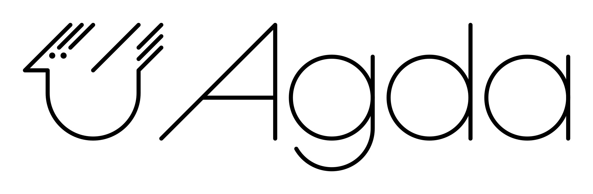

<link rel="stylesheet" href="gh-fork-ribbon.css" />

<a class="github-fork-ribbon" href="https://github.com/teach-types/www" data-ribbon="Sources on GitHub" title="Sources on GitHub">Sources on GitHub</a>

{#id .class width=480}

Most course information is on [Canvas](https://chalmers.instructure.com/courses/35737).

Further course links:
[Schedule on TimeEdit](https://cloud.timeedit.net/chalmers/web/public/riq30Qy6565ZZ5Q59g7650Z56YZ6019X67oY40QQ06o0gQ176qQY.html) /
[Chalmers studieportal](https://www.student.chalmers.se/sp/course?course_id=40833) /
[GU ad (sv)](https://www.gu.se/studera/hitta-utbildning/typer-for-program-och-bevis-dit235) /
[GU kursplan](http://kursplaner.gu.se/pdf/kurs/sv/DIT235) /
[GU course description](http://kursplaner.gu.se/pdf/kurs/en/DIT235) /
[Old course page](https://www.cse.chalmers.se/~coquand/TYPES2.html)

Schedule
========

| Date | Time | Teacher | Title | Reading / Remark |
|-------|----|-|----------------------------|------------------|
| Thu 04/09   | 10-12   | AA | [Introduction to Agda](#lecture-1) | LN 1 - 3; VFP 1, 3; DTW 1, 2.1 - 2.5 |  |
| Mon 08/09   | 13-15   | TC | [Dependent types](#lecture-2) |  |
| _Mon 08/09_ | _15-17_ | AA | [Getting started with Agda](#exercise-1) |  |
| Thu 11/09   | 10-12   | TC | [Proving in Agda](#lecture-3) |  |
| Mon 15/09   | 13-15   | TC | [Introduction to operational semantics and type systems](#lecture-4)  | TPL 1-3 |
| _Mon 15/09_ | _15-17_ | TC | [More on Agda](#exercise-2) | _Homework 1 due_  |
| Thu 18/09   | 10-12   | TC | [Introduction to operational semantics and type systems](#lecture-5)  | TPL 3-4 |
| Mon 22/09   | 13-15   | TC | [Introduction to operational semantics and type systems](#lecture-6)  | TPL 5-10 |
| _Mon 22/09_ | _15-17_ | TC | [More on Agda](#exercise-3) | _Homework 2 due_  |
| Thu 25/09   | 10-12   | TC | [Introduction to operational semantics and type systems](#lecture-7)  |  |
| Mon 29/09   | 13-15   | AA | [More on operational semantics and type systems in Agda](#lecture-8)  |  |
| _Mon 29/09_ | _15-17_ | AA | [More on Agda](#exercise-4) | _Homework 3 due_  |
| Thu 02/10   | 10-12   | AA | [More on operational semantics and type systems in Agda](#lecture-9)  |  |
| Mon 06/10   | 13-15   | AA | [More on operational semantics and type systems in Agda](#lecture-10) |  |
| _Mon 06/10_ | _15-17_ | AA | [Exercises on operational semantics and type systems in Agda](#exercise-5) | _Homework 4 due_  |
| Thu 09/10   | 10-12   | AA | [More on operational semantics and type systems in Agda](#lecture-11) |  |
| Mon 13/10   | 13-15   | TC | Student presentations |   |
| Mon 13/10   | 15-17   | TC | Student presentations |   |
| Thu 16/10   | 10-12   | TC | Student presentations |   |
| Mon 20/10   | 13-15   | TC | Student presentations |   |
| Mon 20/10   | 15-17   | TC | Student presentations |   |
| Tue 21/10   | 08-     |    | Take home exam | _Deadline: Fri 24/10 12:00 (noon)_ |

Teachers: TC = [Thierry Coquand](http://www.cse.chalmers.se/~coquand/), AA = [Andreas Abel](http://www.cse.chalmers.se/~abela/).

Literature
==========

Further literature and online access to books via the library can be found on [Canvas](https://chalmers.instructure.com/courses/35737/assignments/syllabus).

* LN  = [An Introduction to Programming and Proving in Agda](http://www.cse.chalmers.se/~peterd/papers/AgdaLectureNotes2018.pdf) (draft), lecture notes
* DTW = [Dependent Types at Work](http://www.cse.chalmers.se/~peterd/papers/DependentTypesAtWork.pdf)
* VFP = [Verified Functional Programming in Agda](http://dl.acm.org/citation.cfm?id=2841316)
* TPL = [Types and Programming Languages](http://www.cis.upenn.edu/~bcpierce/tapl/index.html)

Lectures
========

## Lecture 1

- Introduction to Agda
- Simply-typed programming in Agda

[Agda code](src/Lecture1.agda), [rendered](src/html/Lecture1.html)

## Lecture 2

- Termination checking
- Data types
- Dependent types
- Polymorphism.
- Propositions as sets

## Exercise 1

Getting started with Agda.
Help-session where Andreas will help you get started with Agda programming.
Before this session you need to install Agda and try to write your first Agda programs.
We'll do some simple exercises in Agda.

## Lecture 3

- Proving in Agda
- Inductive predicates
- Propositional and predicate logic

## Lecture 4

Introduction to operational semantics and type systems

## Lecture 5

Introduction to operational semantics and type systems

## Lecture 6

Introduction to operational semantics and type systems

## Lecture 7

Introduction to operational semantics and type systems

## Lecture 8

More on operational semantics and type systems in Agda

## Lecture 9

Boolean expressions and arithmetic expressions in Agda

## Lecture 10

Records and instance arguments

## Lecture 11

Typed lambda calculus in Agda

Software
========

We use Agda version 2.8.0.

Installing Agda from binary
---------------------------

1. Download a suitable binary package from https://github.com/agda/agda/releases/tag/v2.8.0 and put it in your PATH
2. Run `agda --setup`

Installing Agda from source
---------------------------

0. Install latest Haskell (see below)
1. Install Agda from Stackage nightly: `stack install --resolver=nightly Agda`
2. Run `agda --setup`
3. Set up the Agda mode (see below)

Installing Haskell
------------------

1. Install [GHCup](https://www.haskell.org/ghcup/)
2. Install latest Stack (3.7.1) and GHC (9.12.2) from within `ghcup tui`
3. Ensure that the path printed by `stack path --local-bin` is in your system PATH

Setting up the Agda mode (Emacs)
--------------------------------

1. Compile the Emacs lisp files: `agda-mode compile`
2. Install the Agda mode: `agda-mode setup`

Setting up the Agda mode (VSCode)
---------------------------------

Get the `agda-mode` extension (authored by Ting-Gian LUA).
